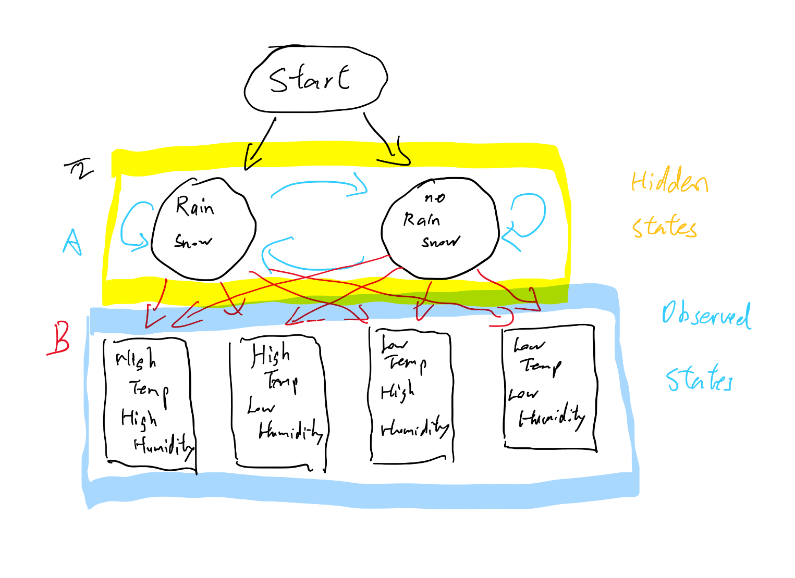

# Weather-Predictor

## Project Abstract

## Introduction
This project aims to construct an agent that can produce accurate predictions of whether it will rain tomorrow in New York based on today's temperature and humidity. This project proposes a probabilistic approach using **Hidden Markov Models (HMMs)** to infer latent weather states, whether there will be rain/snow or not, from historical observational data: daily average dry bulb temperature(°F) and daily average relative humidity(%). We are also using daily precipitation(inch) and daily snow depth(inch) to classify whether a day counts towards rain/snow or towards no rain/snow. By treating weather evolution as a sequence of hidden variables (rain/snow or no rain/snow) influenced by observable variables (temperature and humidity), the model leverages the HMM’s ability to decode **state transitions** and **emission probabilities** from time-series data. The framework is trained on publicly available climate records: [Climate data - New York State. (2022, July 8). Kaggle.] (https://www.kaggle.com/datasets/die9origephit/temperature-data-albany-new-york), preprocessed into discrete observation sequences. The resulting agent can probabilistically forecast near-term weather conditions, offering a lightweight, data-driven alternative to complex numerical models. This work highlights the potential of HMMs in modeling environmental systems where unobserved states drive observable outcomes, bridging the gap between interpretable stochastic models and real-world forecasting applications.

---

* **P**erformance measure: accuracy of its predictions of whether it is going to rain or snow or not.
* **E**nvironment: Only able to see the input statement and the training data.
* **A**ctuators: the input cell (sequence of whether) and output cell (rain/snow or not tommorrow).
* **S**ensors: the input cell.
This is a goal based model, with the only goal to find the probability of rain/snow for the next day given the weather sequence of the previous day(s), and return a output based on that value. This is a model based agent. It trains on the dataset once and will answer only from its training.

##  Data Exploration and Preprocessing Step

### We are using the dataset daily_data.csv

---

There are 2668 number of observations in this training set, each with 19 features. The datas are from January 1st, 2015 to May 31, 2022, which some days missing but we can ignore that since it is a large dataset. The features are: 

> STATION,DATE,REPORT_TYPE,SOURCE,BackupElements,BackupElevation,BackupEquipment,BackupLatitude,BackupLongitude,BackupName,DailyAverageDewPointTemperature,DailyAverageDryBulbTemperature,DailyAverageRelativeHumidity,DailyAverageSeaLevelPressure,DailyAverageStationPressure,DailyAverageWetBulbTemperature,DailyAverageWindSpeed,DailyCoolingDegreeDays,DailyDepartureFromNormalAverageTemperature,DailyHeatingDegreeDays,DailyMaximumDryBulbTemperature,DailyMinimumDryBulbTemperature,DailyPeakWindDirection,DailyPeakWindSpeed,DailyPrecipitation,DailySnowDepth,DailySnowfall,DailySustainedWindDirection,DailySustainedWindSpeed,Sunrise,Sunset,WindEquipmentChangeDate

But we will not be needing all of them. 
We only need the 12th, 13th, 25th, and 26th feature of each observation. The fist 2568 observations are going to be the training data of this project and the last 100 be the validation set. 
The data set is realiable since it was taken directly from a national weather station in Albany, New York.

---

There are 4 columns that we are using are: 
* Daily average dry bulb temperature (°F) (column 12)
* Daily average relative humidity (%) (column 13)
* Daily Precipitation (inch) (column 25)
* Daily Snow Depth (inch) (column 26)

---

### Binarylize features:
* Daily average dry bulb temperature: calculated median for all data points in the training set: 51.0. Any data point with a temperature higher or equal to this threshold will be classified as *high*, others are *low*
* Daily average relative humidity: calculated median for all data points in the training set: 66.0. Any data point with a humidity higher or equal to this threshold will be classified as *high*, others are *low*
* Daily Precipitation: any data point that has a precipitation greater than 0 will be classified as *rain/snow*, others are *no rain/snow*
* Daily Snow Depth: any data point that has a precipitation greater than 0 will be classified as *rain/snow*, others are *no rain/snow*

* The median calculation step is done in **getting thresholds for binarylization.ipynb**

---

## Objective

### Given:
Today's temperature and humidity

### Return:
Is it going to rain/snow tomorrow

---

## Method

### But in order to use the Forwad-Backward Algorithm, we need to set up a HMM

* Hidden States: The weather (rain/snow, no rain/snow).

* Observations: The measured data (temperature, humidity).

#### Model Parameters:

An HMM is defined by three matrices:

1. Transition Matrix A: Probability of moving from state i to j.
  * A_ij = P(next state = j∣current state = i)​,
  * There are 2 possible states: [Rain/Snow, no Rain/Snow]

2. Emission Matrix B: Probability of observing k given state i.
  * B_ik = P(observation = k∣state = i)
  * There are 4 possible observations: [High temp High humidity, High temp Low humidity, Low temp High Humidity, Low temp, Low Humidity]
3. Initial State Distribution: Probability of starting in state i.
  * init_i = P(initial state = i)

#### Computations of the three matrices
Compute the transition matrix A, emission matrix B, and initial distribution π directly from counts.

* A_ij = Number of transitions from state i to j / Total transitions from State i

  * Example: If no Rain/Snow occurs 100 times and transitions to Rain/Snow 20 times:
  > A_Rain/Snow, no Rain/Snow = 20 /100 = 0.2

* B_ik = Count of observation k in state i / Total observations in state i

* π_i = Frequency of state i = Count of state i / Total number of data

### Note: We are not taking Rain/Snow or not from the user input, we are calculating it. Rain/Snow or not is an hidden variable! We believe that the **Forwad-Backward Algorithm** on Hidden Markov Models will produce a more accurate result than just directly returning the likelihood of Rain/Snow or not from data.
